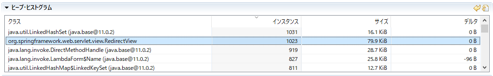

# Thymeleafのリークを調べる

---

## Overview

[Qiita - SpringBoot(Thymeleaf)で動的なリダイレクトをするとメモリリークする (@rhirabay;2019-09-28)](https://qiita.com/rhirabay/items/80fb1e56c266253908f8)

こんな記事教えてもらった。

Thymeleafを使ったプロダクトを作ることになったため、この懸念を払拭するため検証を行う。

## 何が、どうおかしい？

* redirectのviewNameがユニークだとどんどんヒープに溜まる。
* なぜならば、リダイレクトされるたびにインスタンスを生成して、SpringContextに入っているっポイ。

### 確認してみた

https://github.com/thymeleaf/thymeleaf-spring/blob/thymeleaf-spring5-3.0.11.RELEASE/thymeleaf-spring5/src/main/java/org/thymeleaf/spring5/view/ThymeleafViewResolver.java#L779

このL779の話をしている。

``` java
        // Process redirects (HTTP redirects)
        if (viewName.startsWith(REDIRECT_URL_PREFIX)) {
            vrlogger.trace("[THYMELEAF] View \"{}\" is a redirect, and will not be handled directly by ThymeleafViewResolver.", viewName);
            final String redirectUrl = viewName.substring(REDIRECT_URL_PREFIX.length(), viewName.length());
            final RedirectView view = new RedirectView(redirectUrl, isRedirectContextRelative(), isRedirectHttp10Compatible());
            return (View) getApplicationContext().getAutowireCapableBeanFactory().initializeBean(view, viewName);
        }
```

確信は無いが、initializeBeanはBeanの前後の処理を挟み込むための何か？

DIコンテナ内に保存していそうに見えない。

確認のため、コンテナ内に作られているはずのBeanが無いか探してみる。

``` java
    @RequestMapping(value="/hoge/{uuid}", method=RequestMethod.GET)
    public String requestMethodName(@PathVariable String uuid, Model model) {
        System.out.println(ctx.getAutowireCapableBeanFactory().containsBean("redirect:/hoge/" + uuid));
        model.addAttribute("uuid", uuid);
        return "/redirect";
    }
```

もちろん、見つからない。

## とはいえHeap内にはあるんでしょ？だってHeapDumpで確認したって言っているし

なので、JFRでさくっと覗いてみた。



確かにいっぱいいる。

## じゃあどこやねん

ステップ実行でたどっていると、親クラス内でキャッシュしている部分を発見。  
ViewResolverにはViewをCacheする機構が存在しており、setCacheでキャッシュするかどうかの制御もできる。

この辺をいじるとキャッシュ量が減った。  
これかなぁ。

# すいそく

結局、Springコンテナ内には特にBeanがたまっている様子はなく、ViewResolverでデフォルトキャッシュを行う機構が存在するため、一定量は溜まっていくっポイ。  
また、このままJMeterでリダイレクトさせまくったところ、1023を上限に増えることは無い。

ヒープを64Mくらいまで縮めてJMeterで叩き続けてもHeapがあふれる様子は無し。

# 結論

恐らくだが、キャッシュ機構が働いてずんずん増えていくオブジェクトを見て誤認した？  
もしくは、過去の記事であるため、バージョンアップ中に別地点で発生していたリークが改善された？

取り急ぎ問題はなさそうに思えたので調査終了する。
